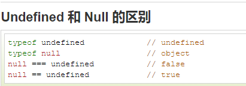
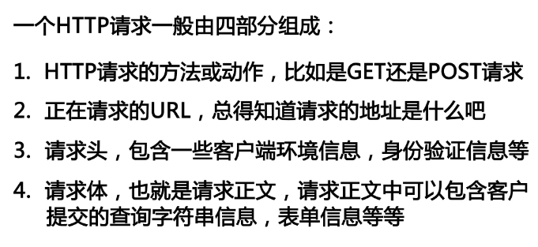

##### 1.在`javascript`中`null`用于对象，`undefined`用于变量，属性和方法。对象只有被定义，才有可能为`null`，否则为`undefined`。
##### 

##### 2.回调函数是一种以参数的形式传递给另一个函数的函数

##### 3.`ajax`的核心内容是向服务器端发送异步请求的代码

##### 4.当发送数据大于512个字节时，`GET`方法失效，改用`POST`

##### 5.`HEAD`指向的版本就是当前的版本，使用`git reset --HEAD commit_id`

##### 6.`JavaScript`是单线程执行，不能进行同步IO操作

##### 7.`JavaScript`语言自身只有字符串数据类型，没有二进制数据类型。但在处理像TCP流或文件流时，必须使用到二进制数据

##### 8.所有 JavaScript 数字均为 64 位.精度：
######&nbsp;&nbsp;&nbsp;&nbsp;整数（不使用小数点或指数计数法）最多为 15 位。
######&nbsp;&nbsp;&nbsp;&nbsp;小数的最大位数是 17，但是浮点运算并不总是 100% 准确。

##### 9.HTTP

