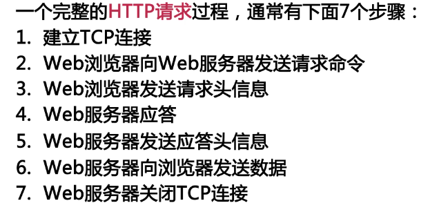

##### 1.在`javascript`中`null`用于对象，`undefined`用于变量，属性和方法。对象只有被定义，才有可能为`null`，否则为`undefined`。
##### 

##### 2.回调函数是一种以参数的形式传递给另一个函数的函数

##### 3.`ajax`的核心内容是向服务器端发送异步请求的代码

##### 4.当发送数据大于512个字节时，`GET`方法失效，改用`POST`

##### 5.`HEAD`指向的版本就是当前的版本，使用`git reset --HEAD commit_id`

##### 6.`JavaScript`是单线程执行，不能进行同步IO操作

##### 7.`JavaScript`语言自身只有字符串数据类型，没有二进制数据类型。但在处理像TCP流或文件流时，必须使用到二进制数据

##### 8.所有 JavaScript 数字均为 64 位精度：
* 整数（不使用小数点或指数计数法）最多为 15 位。
* 小数的最大位数是 17，但是浮点运算并不总是 100% 准确。

##### 9.HTTP



##### 10.`JavaScript`类型转换
* Number() 转换为数字， String() 转换为字符串， Boolean() 转化为布尔值。
* JavaScript 数据类型
* 在 JavaScript 中有 5 种不同的数据类型：string number boolean object function
* 3 种对象类型： Object Date Array
* 2 个不包含任何值的数据类型： null undefined


##### 11.使用 constructor 属性来查看对象是否为数组 (包含字符串 "Array"),同理查看是否为Date
```javascript
function isArray(myArray) {
    return myArray.constructor.toString().indexOf("Array") > -1;
}
```
##### 12.表单email验证:输入的数据必须包含 @ 符号和点号(.)。同时，@ 不可以是邮件地址的首字符，并且 @ 之后需有至少一个点号：
```javascript
function validateForm(){
  var x=document.forms["myForm"]["email"].value;
  var atpos=x.indexOf("@");
  var dotpos=x.lastIndexOf(".");
  if (atpos<1 || dotpos<atpos+2 || dotpos+2>=x.length){
    alert("不是一个有效的 e-mail 地址");
    return false;
  }
}
```

##### 13.自调用函数
* 函数表达式可以 "自调用"。
* 自调用表达式会自动调用。
* 如果表达式后面紧跟 () ，则会自动调用。
* 不能自调用声明的函数。
* 通过添加括号，来说明它是一个函数表达式：
```javascript
(function () {
    document.getElementById("demo").innerHTML = "Hello! 我是自己调用的";
})();
```
##### 14
* JavaScript 函数有 4 种调用方式。
* 每种方式的不同方式在于 this 的初始化。
> 作为一个函数调用、
> 函数作为方法调用、
> 函数作为方法调用、
> 作为函数方法调用函数

##### 15.闭包是可访问上一层函数作用域里变量的函数，即便上一层函数已经关闭。

##### 16.事件冒泡与事件捕获
* 事件捕获阶段：事件从最上一级标签开始往下查找，直到捕获到事件目标(target)。
* 事件冒泡阶段：事件从事件目标(target)开始，往上冒泡直到页面的最上一级标签。
* true=捕获  false=冒泡
```javascript
ele.addEventListener('click',functionDoSomethig,true)
```
##### 17. EventListener 传递参数
当传递参数值时，使用"匿名函数"调用带参数的函数：
```javascript
element.addEventListener("click", function(){ myFunction(p1, p2); });
```
##### 18.数组创建新方法
```javascript
Array.prototype.myUcase=function(){
	for (i=0;i<this.length;i++){
		this[i]=this[i].toUpperCase();
	}
}
function myFunction(){
	var fruits = ["Banana", "Orange", "Apple", "Mango"];
	fruits.myUcase();
	var x=document.getElementById("demo");
	x.innerHTML=fruits;
}
```
